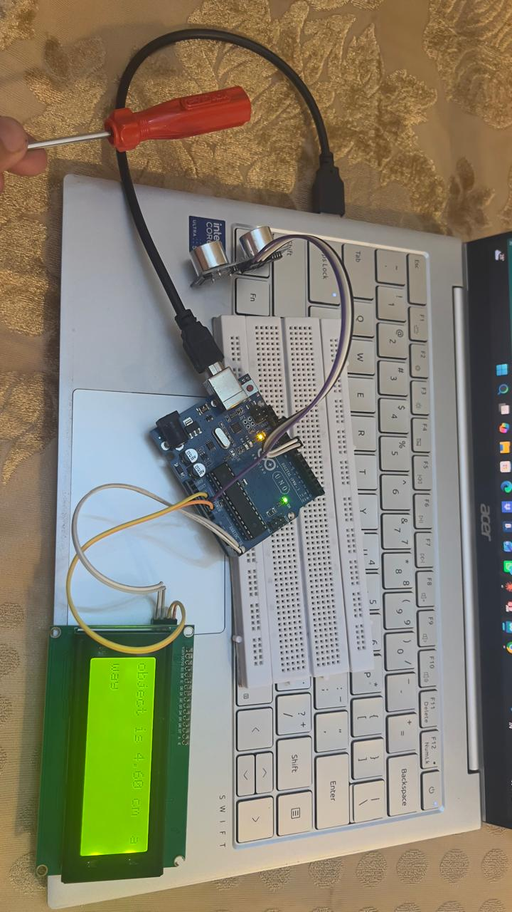

# Ultrasonic Distance Meter (Arduino + HC-SR04 + I2C LCD)

A standalone distance meter built as the first working sub-module of the
**Autonomous Room Cleaner (ARC)** project. This module reads distance using
an HC-SR04 ultrasonic sensor and displays it live on a 20x4 I2C LCD.

## Demo

## Parts Used
- Arduino Uno
- HC-SR04 ultrasonic sensor
- 20x4 I2C LCD (2004A-V1.3) with PCF8574-based I2C backpack
- Jumper wires

## Wiring

| HC-SR04 pin | Arduino pin |
|---|---|
| VCC | 5V |
| GND | GND |
| Trig | 9 |
| Echo | 10 |

| LCD pin | Arduino pin |
|---|---|
| VCC | 5V |
| GND | GND |
| SDA | A4 |
| SCL | A5 |

## How It Works
1. Arduino sends a 10-microsecond HIGH pulse on `Trig`, triggering the sensor
   to emit an ultrasonic burst.
2. `Echo` goes HIGH the instant the burst is sent, and LOW the instant it's
   received back — so the HIGH duration is the round-trip travel time.
3. Distance is calculated as:
   `distance (cm) = (duration_in_microseconds / 2) * 0.0343`
   (0.0343 cm/microsecond is the speed of sound converted from 343 m/s.)
4. The result is printed to the I2C LCD, refreshed continuously.

## Code
See [`distance_meter.ino`](./distance_meter.ino)

## Problems I Ran Into (and how I fixed them)
- **I2C scanner found nothing at first** — SDA/SCL were wired to digital pins
  (3/5) instead of the Uno's dedicated I2C pins (A4/A5); VCC was also wired to
  a digital pin instead of 5V. Fixing the wiring to the correct pins solved it.
- **Upload failed with `avrdude: ser_open(): Access is denied`** — caused by
  an open Serial Monitor window holding the COM port. Closing it and
  re-uploading fixed this.
- **`LiquidCrystal_I2C.h: No such file or directory`** — the library wasn't
  installed yet; installed via Library Manager (Kubovčík/de Brabander
  maintained version).
- **LCD backlight on but nothing displayed** — turned out to be the contrast
  potentiometer on the I2C backpack, which was set too low to show characters.
- **Readings spiked upward at very close range (<3-4cm)** — a known HC-SR04
  limitation: transducer "ringing" after the pulse and very short round-trip
  times make readings unreliable below the sensor's minimum range.
- **Display flickered on fast updates** — reduced update rate for
  readability. Note: for the *robot* (not just this standalone meter), this
  delay needs to stay short (~60ms) for fast obstacle-reaction time — the
  slower delay was only appropriate for this LCD-readability test.

## What's Next
This sensor and its distance calculation will be reused directly in ARC's
obstacle-avoidance logic — see the main [ARC](../) repo for the full build.
